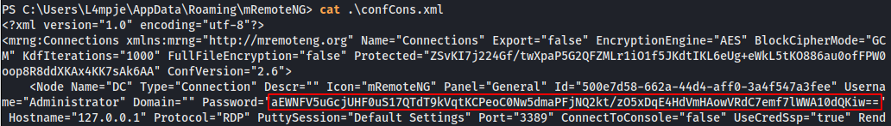

# Bastion


**Tools: nmap, smbclient, smbmap, 7z, guestmount, samdump2, mRemoteNG-Decrypt, Impacket (secretsdump.py).**

We start with the nmap scan of the host:  
`nmap -Pn -sC -sV -p- -T4 --min-rate=10000 10.10.10.134`


We see quite a few open ports, but 139/445 grabs our attention, so let's try to enumerate SMB with smbclient.  
`smbclient -L //10.10.10.134`


Alternatively we can use smbmap to see the permissions.  
`smbmap -u WhateverYouWantHere -H 10.10.10.134`


We can see some shares, but the one we are able to mount on our system is the 'Backups', so we create a new folder at '/mnt' (in my case '/bastion') and we mount the share.


Inside the share are 2 files and the folder 'WindowsImageBackup' - inside it is another folder called 'L4mpje-PC', and inside this one the 'Backup 2019-02-22 124351' has the vhd and xml files of the backup.


We can use 7-zip to list the files inside the vhds.  
```
7z l 9b9cfbc3-369e-11e9-a17c-806e6f6e6963.vhd  
7z l 9b9cfbc4-369e-11e9-a17c-806e6f6e6963.vhd
```


Let's use guestmount to mount this one to our machine. Create a directory at '/mnt', in my case '/vdisk'.  
`guestmount --add 9b9cfbc4-369e-11e9-a17c-806e6f6e6963.vhd --inspector --ro -v /mnt/vdisk`


Next up, we access the disk and start the enumeration.


After taking a look around, I didn't find anything that special, so it's better to go straight for the SAM and SYSTEM files to try and get some user's password hash to crack it. I've created a folder '/htb' in my machine to copy the files to it. To get the hashes, we can either use samdump2 or Impacket's secretsdump.  
```
samdump2 SYSTEM SAM  
secretsdump.py -sam SAM -system SYSTEM local  
```


The Administrator and Guest accounts are disabled, hence the '31d6cfe...' hash, but we are able to see the user L4mpje and his hashed password. We can use a few sites to crack this NTLM hash, like the ones below.  
```
https://hashes.com/en/decrypt/hash  
https://crackstation.net/
```


We get our user password, so let's test the SSH authentication.


We are able to log into the Bastion computer, and we can run some commands.  
```
net user L4mpje  
net user administrator  
net localgroup administrator  
```


Besides some date-time info, there's nothing else of use. So it's time to enumerate the box.   
At 'Program Files (x86)' we can see an interesting directory, 'mRemoteNG'. This is a tool use to manage remote connections to Windows.


Inside this folder there's no valuable information, but then looking at the user's Appdata\Roaming we are able to find some configuration files. The 'confCons.xml' has the password for Administrator encoded in base64.



After some research, we're able to confirm that this is a known critical vulnerability of mRemoteNG, and there are tools to decrypt the stored passwords. In our machine, we download mremoteng_decrypt.py from this [GitHub repository](https://github.com/haseebT/mRemoteNG-Decrypt) and then we run the script, using the -s flag followed by the encrypted password.  
`python3 mremoteng_decrypt.py -s encryptedpasswordhere`


And there it is, the Administrator password. We can try to use SSH and see if we're lucky...


That's it, we're Admin, so we can just grab the root flag from the Desktop directory.  
