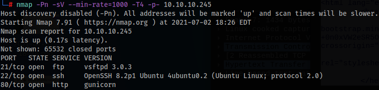
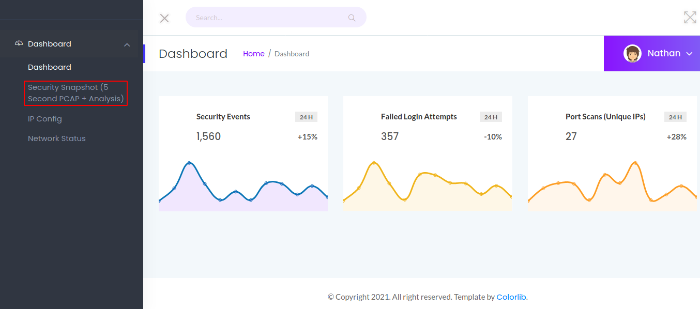
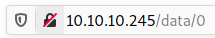
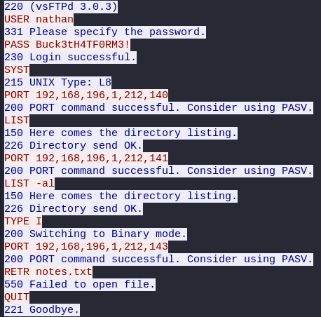
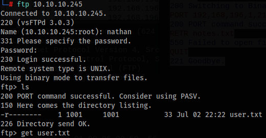
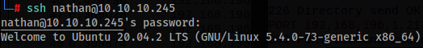
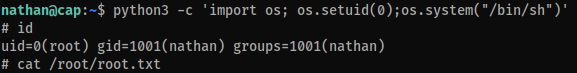

# Cap
This is probably the easiest HTB machine at the moment of its release/retirement, the entire process is pretty straightforward but fun.  

**Tools: nmap, Wireshark.**  

Let's begin with the nmap scan:  
`nmap -Pn -sV --min-rate=10000 -T4 -p- 10.10.10.245`

Let's take a look at the webpage:  

After testing some options, we can see some PCAPs but there's no useful information in here. At the URL we see that there's some number/ID at the end of the link, and after taking a look at all the captures (there's a download button at the page), we see that there's also a PCAP with the ID 0.  

Using Wireshark to analyze the PCAPs, in the FTP packets, right-click on it and 'Follow' > 'TCP Stream'. This one reveals us an username and password, used to authenticate in the FTP server.  

Now we can log into ftp with the credentials and get our user flag:  

Now let's try to get access to the box through SSH with the same credentials:  

Our user doesn't have root access, but after 'blindly' testing a quick python privesc, we become root, and then we can grab our root flag.  
`python3 -c 'import os; os.setuid(0);os.system("/bin/sh")'`  

**That's all folks!**  
Thanks for reading and keep hacking!
