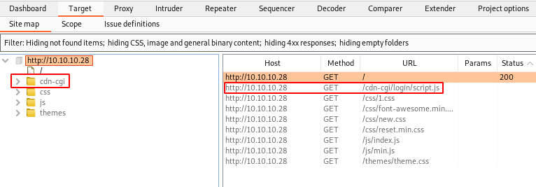
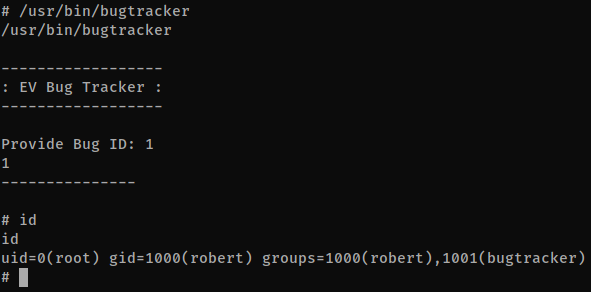

# Oopsie


**Tools: nmap, Burp Suite, gobuster, netcat.**

First of all, we can run a nmap scan — this machine’s IP is 10.10.10.28:  
`nmap -n -sSV -sC -Pn 10.10.10.28`


We can see that the ports 22 (ssh) and 80 (http) are open. Let’s investigate the http service, so we open Firefox and go to http://10.10.10.28:80


The website above doesn’t take us anywhere when we click in the options, so we should investigate it further using Burp Suite as our proxy.  
 We simply open Burp Suite and make sure that the ‘Intercept’ option under the ‘Proxy’ tab is set to ‘On’.  
  Now we go to the Firefox ‘Network settings’, and enable ‘Manual Proxy’, set it to 127.0.0.1, port 8080 and check the option below it (‘Also use this proxy for FTP and HTTPS’).  
 Next up, we refresh the website and check Burp, tab ‘Site map’ under ‘Target’.  
 (From now on, every time we refresh/change pages in our browser, we’ll need to click on the ‘Forward’ button at the ‘Intercept’ tab under ‘Proxy’.)



We see this ‘cdn-cgi’ directory, and under it there’s a ‘login’ directory. Upon accessing it (http://10.10.10.28/cdn-cgi/login/) we see a login form.


So, remember the previous box, Archetype? We should try some of those credentials. The ‘administrator’ username doesn’t work, but if we try ‘admin’ and the password ‘MEGACORP_4dm1n!!’ we successfully access the website’s administration section.


After taking a look around, we see that the ‘Uploads’ section can only be accessed by a ‘super admin’.


So, back to Burp. If we access the ‘Account’ tab in the website, we’ll see a request at the ‘Intercept’ tab in Burp, and some curious information.


Apparently, each user has an account ID and an User ID associated. We could try to manipulate this, to find out the IDs of the ‘super admin’ user. To do that on Burp, click on Ctrl+i to transfer this request information to the ‘Intruder’ tab. Under ‘Intruder’, go to the ‘Positions’ tab and click on the ‘Clear’ button on the far right, select the ‘1’ after the ID (first row of the request) and click on the ‘Add’ button. This way we’ll run a loop on this ID field, so we can test the responses and find the super admin. Now go to the ‘Payloads’ tab. I recommend creating a file with a list of IDs, from 1 to 100 — run this command in your terminal, and after that click on ‘Load…’ under ‘Payload Options’ and select the file you’ve just created.  
`for x in $(seq 1 100);do echo $x;done > ids.txt`


Next up, go to the ‘Options’ tab, and at the bottom of the page under ‘Redirections’, select ‘Always’ to Follow redirections, and check the ‘Process cookies in redirections’ box.


Now we just need to go back to the ‘Target’ tab and click on ‘Start Attack’. Another window will be open and the results will start to show up. If we order the results by ‘Length’, we notice that there are a few results with different lengths, and the request number 30 is on the top of the list.


If we select the request 30 and click on ‘Response’ under the list of requests, we can inspect the code. By the end of the response, we’ll be able to see the following information:


So that’s it, the ‘super admin’ ID is 86575, and from now on, everytime we need to Forward a request in Burp, before doing so, we need to change the ID after ‘user=’ to this one we’ve just found.


Now we can use this ID to access the ‘Uploads’ on the website. Upon doing so, we see a file upload form.


I’ve downloaded and extracted a php reverse shell from [pentestmonkey.net](http://pentestmonkey.net/tools/web-shells/php-reverse-shell), edited the file php-reverse-shell.php and changed the IP field to my HTB VPN IP (10.10.15.54) and the port to a random one (10666). Now we just need to upload the file, remembering to change the ‘user=’ to 86575 every time we need to forward a request.


To find out where the uploaded files go, I ran a quick gobuster:  
`gobuster dir -u http://10.10.10.28 -w /usr/share/dirbuster/wordlists/directory-list-2.3-medium.txt`


The files are probably at /uploads then…let’s set our netcat listening session in the terminal and try to access the reverse shell file from the browser, changing the ‘user’ as always to 86575:  

**Terminal:**  
`nc -vnlp 10666`

**Browser:**  
`http://10.10.10.28/uploads/php-reverse-shell.php`


We have a shell, but it’s a simple (dumb) shell. To upgrade it to a fully interactive shell, I quickly checked if the box had python installed. ‘python -V’ returned an error, but ‘python3 -V’ returned the Python3 version. With that in mind, I’ve used the command below to quickly upgrade my shell:  
`python3 -c ‘import pty; pty.spawn(“/bin/bash”)’`

The official walkthrough suggest the commands below, I’m posting it here as an option:  
```
SHELL=/bin/bash script -q /dev/null  
Ctrl-Z  
stty raw -echo  
fg  
reset  
xterm  
```

Upon checking it, we see that we’re logged in as www-data, so we can take a look into some folders, and eventually find the user.txt file containing the User flag, under /home/robert/


But besides that, we’re pretty stuck with this user. We should check the website’s folders at /var/www/html. After spending some time, we find the folder /cdn-cgi/login/ that contains some interesting files.


Quickly checking them reveals that the ‘db.php’ file has another user’s credentials saved.


So let’s access Robert’s user, providing the password found.  
`su robert`


Upon checking its id, we see that this user is part of a ‘bugtrack’ group. We should check what files this group has access to:  
`find / -type f -group bugtracker 2> /dev/null`


So we find the binary file ‘bugtracker’. Right away we notice that it has SUID permissions (the ‘s’ in the user ‘execute’ field, it runs ‘as’ its creator, in this case, root), we can run it to test. When it asks us for an ID, we can insert a random number just to see what it does.


There’s not much info in here, so a good option is to see what the binary does when you run it. We do so by checking its strings:  
`strings /usr/bin/bugtracker`

There’s the ‘cat /root/reports’ row that grabs our attention right away. We could abuse this to escalate our privileges. The official walkthrough explains this very well:  

“We see that it calls the cat binary using this relative path instead of the absolute path. By creating a malicious cat , and modifying the path to include the current working directory, we should be able to abuse this misconfiguration, and escalate our privileges to root. Let’s add the current working directory to PATH, create the malicious binary and make it executable.”  
```
export PATH=/tmp:$PATH  
cd /tmp/  
echo ‘/bin/sh’ > cat  
chmod +x cat
```

And then we run the binary once again…



So now we’re root!  
At this point, I couldn’t read any files anymore in that shell, so I simply ran a ‘vim /root/root.txt’ and grabbed the root flag from inside the file.  

Through further enumeration of the box, we can find FTP credentials that can be useful in the next boxes of the Starting Point path:  
```
/root/.config/FileZilla  
ftpuser  
mc@F1l3ZilL4
```


