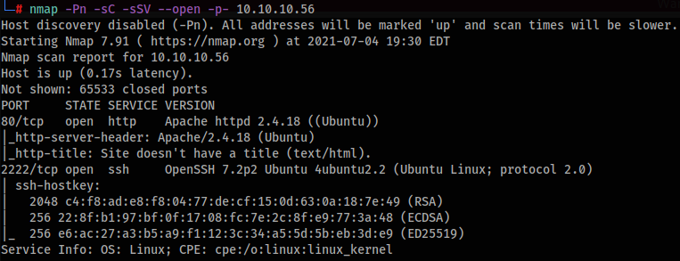
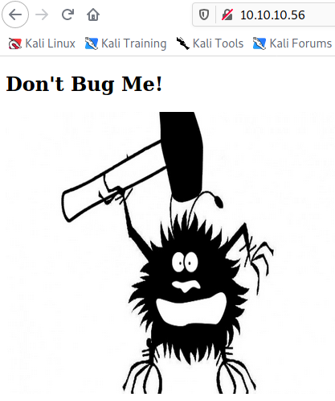
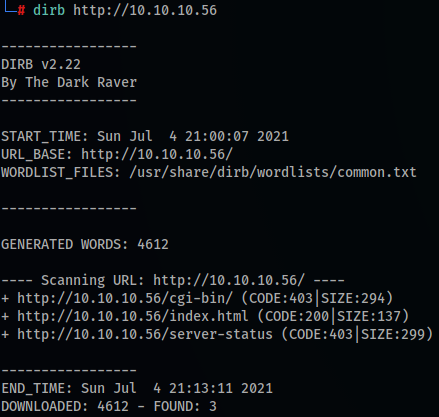
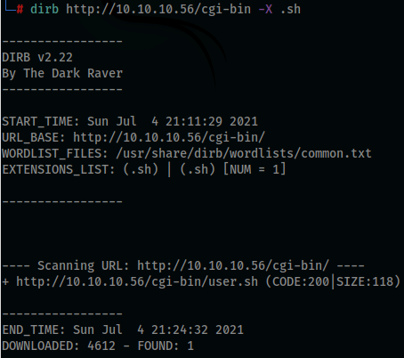
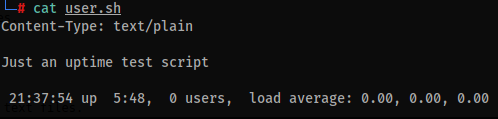
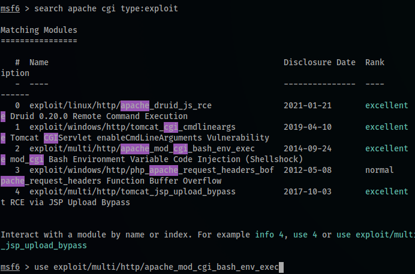
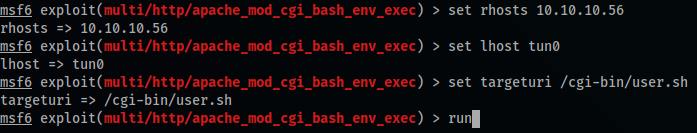
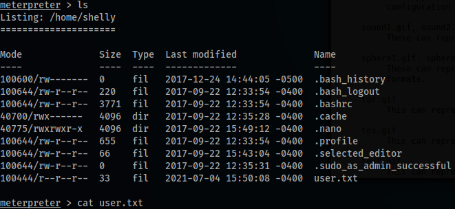
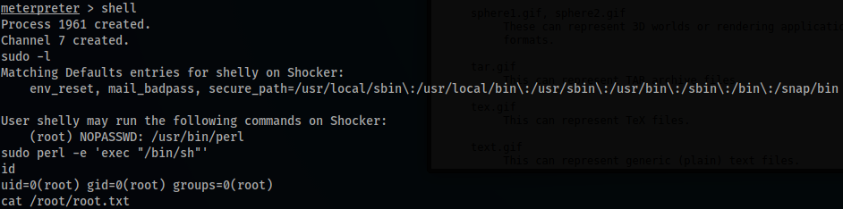

# Shocker
In this writeup we'll pwn the Shocker box, an Easy challenge that uses a very well-known vulnerability.

**Tools: nmap, dirb, Metasploit.**

We begin with a scan using nmap (this machine’s IP is 10.10.10.56):
> nmap -Pn -sC -sSV --open -p- 10.10.10.56

Ports 80 and 2222 are open, so let's take a look at the webpage on port 80:

Nothing there, using Firefox' dev-tools doesn't show anything as well.  

Let's try some fuzzing with dirb to find interesting directories:
> dirb http://10.10.10.56

We've found /cgi-bin/ and it is our next target, because it's a directory known for the Shellshock vulnerability. We can try running dirb again, providing some different extensions like .sh:
> dirb http://10.10.10.56/cgi-bin -X .sh

We can try downloading the file we've just found by accessing the webpage and then we can read it.
> http://10.10.10.56/cgi-bin/user.sh

It's not so useful, but now that we have a full path to a file inside cgi-bin, we can run Metasploit with the respective exploit.

Next up we configure the exploit/payload:

We got a meterpreter shell! Now we can grab the user flag...

Now we force metasploit to give us a local shell, then we check for the files we can run with sudo permission with sudo -l (as you can see below, it's perl, so it's an easy privilege escalation):
> sudo perl -e 'exec "/bin/sh"'

Thats it, we're root and the root flag is ours!   

Thanks for reading and keep hacking!
