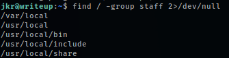

# Writeup
This is an easy, pretty fun box. The entire process uses some interesting concepts to get access and escalate privileges.

**Tools: nmap, searchsploit, hashcat, pspy, openssl.**

We begin with a quick nmap scan of the box:
> nmap -Pn -sC -sV -p- -T4 --min-rate=10000 10.10.10.138

Ports 22 (SSH) and 80 (http) are open, let's take a look at the webpage:

Nmap identified a robots.txt and a disallowed entry. Let's check'em both:

Nothing notable of attention. Let's take a look at the page source:

We can see that there's a 'CMS Made Simple' (open source content management system), and a '2004-2019' copyright info. With the help of exploit-db (or searchsploit) we can find the SQLi exploit below:

Next up, let's download the Python 2 script and try to run it. If an error with the 'termcolor' python library occurs, simple copy the lib from the python 3 directory like below (if you don't have the termcolor lib in the python 3 directory, get it with 'pip'):

The exploit finds the salt for the password, username, an e-mail address and the hashed+salted password. We can run hashcat with rockyou.txt to try and crack the password:

And there it is, the password was found. Now we can use SSH and the credentials to log into the machine:

After taking a good look at the privilege escalation options, we end up using pspy to monitor linux processes without root permissions, we simply download the file from its [GitHub repository](https://github.com/DominicBreuker/pspy), send it to the box, give it permission to run and then run it.

Nothing so obvious shows up, until we log into SSH in another terminal tab, then this happens:

So basically when the user logs in with SSH, a new PATH environment variable is set, which is used to run the **run-parts** (a proccess that runs all the executable files found in the directory). The run-parts binary, as default, is at /usr/bin, but after quickly checking our user's groups, we find that he is part of the 'staff' group, and (as shown below) it has access to the /usr/local/bin. In the PATH we can see that /usr/local/bin appears before /usr/bin, and so we can make our own executable file and make it run when we login (before the true run-parts).

One interesting trick is to create a new user, with root permissions. We can use openssl to hash our password and then create our script/command (give it permission to run and copy it to the /usr/local/bin folder). My user and password are 'master'.

Next up, in a new terminal tab, log into SSH one again and, if everything works, we'll switch to our newly created user and we'll be root.

**That's it folks!**  
Thanks for reading and keep hacking!
