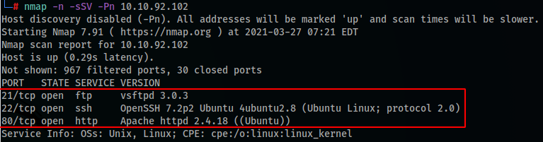
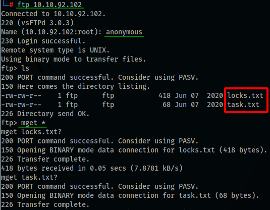
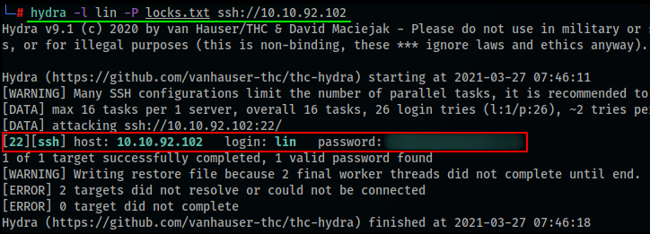
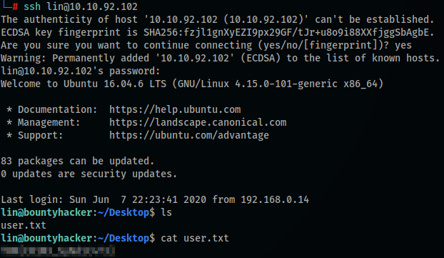
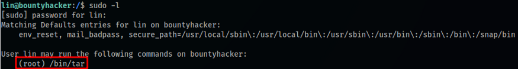
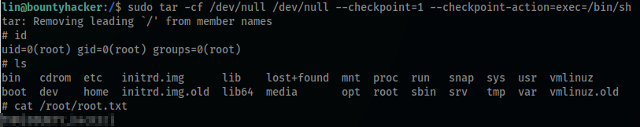

# Bounty Hacker
This is a fun, quick and rated easy box, very beginner friendly.

**Tools: nmap, hydra.**

Let’s run the nmap scan (my target machine’s IP is 10.10.92.102):
> nmap -n -sSV -Pn 10.10.92.102

We see that the ports 21 (ftp), 22 (ssh) and 80 (http) are open.

**Who wrote the task list?**  
*Hint: Have you visited FTP?*  
To answer the first question, we’ll begin enumerating the services in the open ports. Let’s start with the FTP service, we can try to see if it has ‘anonymous’ access enabled:

We could successfully login as ‘anonymous’, list (ls) and download (mget \*) all the files in the repository. Upon reading the 2 files (cat) we could see that, the ‘locks.txt’ file contains a list of, possibly, passwords, so we’ll save it for later. Now, the ‘tasks.txt’ file, contains a list of tasks and a name. This is the name we’re looking for, so..
> Answer: lin

**What service can you bruteforce with the text file found?**  
*Hint: What is on port 22?*  
As we’ve seen in the nmap scan…
> Answer: SSH

**What is the user’s password?**  
*Hint: Hydra may be able to help.*  
Now let’s use the passwords list we’ve just found to try a bruteforce on the SSH service for the user ‘lin’. We can use Hydra for this:
> hydra -l lin -P locks.txt ssh://10.10.92.102

The bruteforce quickly finds the correct password, so the answer for this topic is this password found.

**user.txt**  
Now that we have the user+password for the SSH access, let’s go ahead and log into the service:
> ssh lin@10.10.92.102

After the login, and checking the current directory (ls), we see that there is a user.txt file, so we can simply read it (cat) and grab the user flag.

**root.txt**  
To be able to grab the root flag, we’ll need to escalate our privileges to root. A good practice is to check what you’re able to run with sudo, to do so:
> sudo -l

We see that we can run the binary *‘tar’* as root. We can check at [**GTFOBins**](https://gtfobins.github.io/) if there’s a privesc command to abuse this. So we find this under the *‘tar’* and *‘sudo’* filters:
> sudo tar -cf /dev/null /dev/null — checkpoint=1 — checkpoint-action=exec=/bin/sh

Running the command we get root shell and can quickly grab the flag from the /root directory.

**That’s all folks!**  
Thanks for reading and keep hacking!
